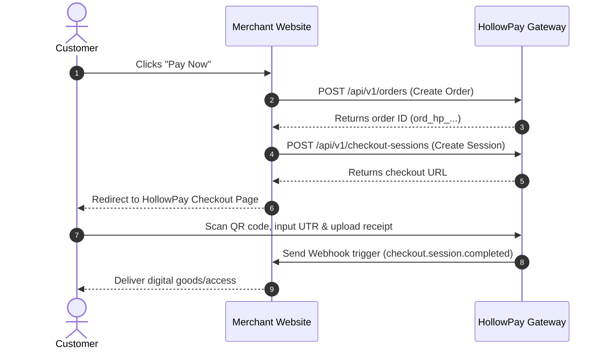

# HollowPay ⚡

> **Our fee? Hollow.**
> High-fidelity, zero-fee UPI payment aggregator, checkout orchestration, and compliance telemetry platform. Built by [ZeroDayCops](https://zerodaycops.in).

---

## 📖 Table of Contents
- [Overview](#overview)
- [Key Features](#key-features)
- [System Architecture](#system-architecture)
- [Payment & Compliance Telemetry](#payment--compliance-telemetry)
- [Tech Stack](#tech-stack)
- [Local Development & Setup](#local-development--setup)
- [API & Integration Reference](#api--integration-reference)
- [Security Charter](#security-charter)
- [License](#license)

---

## 🎯 Overview

HollowPay is an open-source, multi-tenant hosted checkout and payment records layer designed for modern web apps. It facilitates zero-trust direct-to-merchant UPI payment flows without charging a platform fee. It coordinates checkout sessions, captures UTR reference proofs, tracks fraud collisions, and manages secure webhook dispatches.

---

## ✨ Key Features

- 📱 **Hosted Checkout Screen** — High-fidelity, mobile-first payment UI with dynamic QR codes.
- ⚙️ **Developer REST API** — Integrate payment flows into any custom website in minutes.
- 📦 **API Usage Telemetry & Logs** — Real-time request log monitoring, key rotation, and rate telemetry.
- 🔐 **Secure Key Rotation & Webhooks** — Webhook delivery retry loops with HMAC-SHA256 signature verification.
- 🕰️ **Abandoned Checkout Expiry** — Automatic background workers to clean up stale or unpaid sessions.
- 🛡️ **Risk & Fraud Collisions Monitoring** — Automated verification flags for double UTR claims and suspicious behaviors.
- 🏢 **Multi-Tenant Workspace** — Support for multiple merchant accounts, project environments, and developers.

---

## 🏗️ System Architecture

HollowPay functions as a stateless coordination layer. Funds flow directly from the customer's UPI app to the merchant's UPI address.



---

## 📊 Payment & Compliance Telemetry

Unlike traditional payment pipelines, HollowPay uses an asynchronous compliance model to confirm UPI transactions:
1. **Initiation**: The customer initiates a payment scan.
2. **Claim Submission**: The customer uploads the payment receipt and inputs the 12-digit UPI UTR.
3. **Collision Detection**: HollowPay automatically flags if the UTR was used previously (fraud mitigation).
4. **Merchant Verification**: The merchant confirms receipt of funds in their bank account.
5. **Settlement**: A permanent, immutable ledger transaction is created.

---

## 💻 Tech Stack

- **Framework:** Next.js 16 (App Router)
- **Database:** Neon Serverless PostgreSQL
- **ORM:** Drizzle ORM
- **Auth Guard:** Clerk (Multi-Tenant Organization support)
- **Object Storage:** Cloudflare R2 (S3-compatible)
- **Deployment:** Vercel

---

## 🚀 Local Development & Setup

### Prerequisites
- Node.js 20+
- npm 10+
- A Neon PostgreSQL database instance
- A Clerk Developer Account

### Setup Instructions
1. **Clone the Repository:**
   ```bash
   git clone https://github.com/ZeroDayCops/HollowPay.git
   cd HollowPay
   ```

2. **Install Dependencies:**
   ```bash
   npm install
   ```

3. **Configure Environment Variables:**
   Copy `.env.example` to `.env.local` and insert your credentials:
   ```bash
   cp .env.example .env.local
   ```

4. **Sync Schema & Seed DB:**
   Push database schemas and populate standard tables:
   ```bash
   npx drizzle-kit push
   npm run seed
   ```

5. **Start Dev Server:**
   ```bash
   npm run dev
   ```
   Open [http://localhost:3000](http://localhost:3000) to view the developer dashboard.

---

## 📖 API & Integration Reference

For detailed backend integration guidelines, payload samples, and webhook validation code snippets, consult our **[Developer Integration Guide (INTEGRATION.md)](./INTEGRATION.md)**.

---

## 🛡️ Security Charter

HollowPay takes security seriously:
- Webhooks are securely signed using HMAC-SHA256 signature hashes.
- Absolute isolation between Live Mode and Test Mode keys.
- Automatic session timeouts to clear abandoned checkouts.

If you identify a security issue, please email `security@zerodaycops.in` or read our [Security Policy](./SECURITY.md).

---

## 📄 License

HollowPay is open-source software by [ZeroDayCops](https://zerodaycops.in). License pending final decision.

